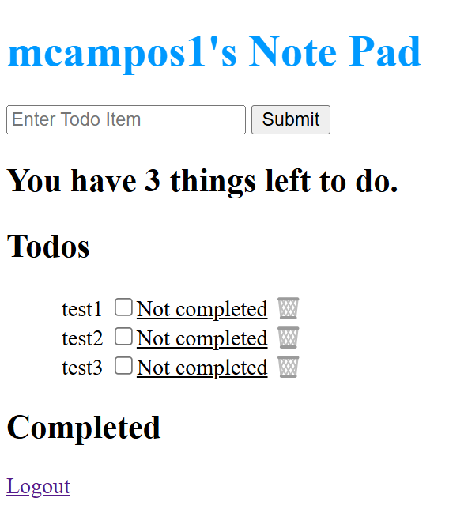

# Full-stack Todo List

## How It's Made:

**Tech used:** 

## Optimizations:

This project is an improvement to a previous CRUD application. With more time on my hands I want to create a pleasing UI that facilitates the user experience. I also will be exploring methods to incorporate two users logged into the same todo list. Imagine a family shopping list were two or more people can add live items to the list.

## Lessons Learned:

Working with my colleague Khan we were able to improve on how the EJS template could allow us to move content from one element to another. Having property value pair the track the status of an object was key to incroporating our solution and creating a smooth manipulation of our database documents.  

